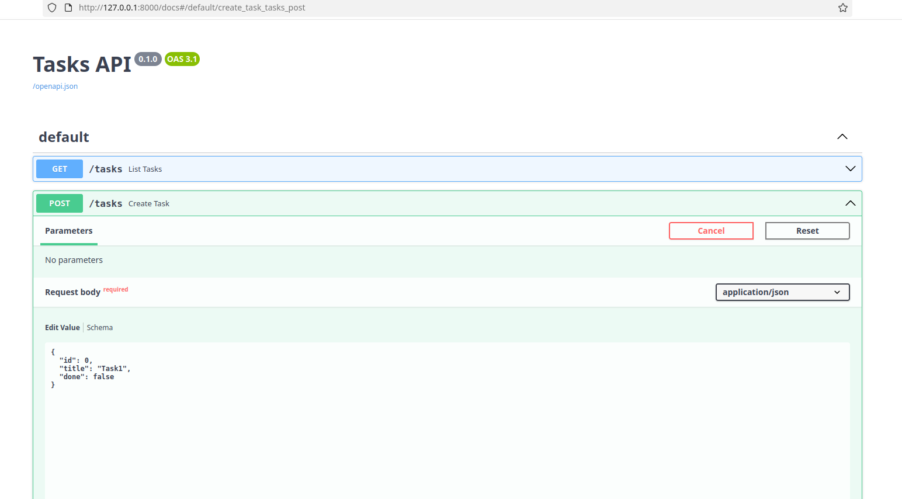

# FastAPI Tasks API

A simple microservice for managing tasks (GET, POST, DELETE).

Files:
- `main.py` - FastAPI app
- `tasks.json` - simple JSON-based storage

## Installation
1. Install dependencies:

pip install -r requirements.txt

## Running the app

uvicorn main:app --reload

Access Swagger UI at `http://127.0.0.1:8000/docs`

